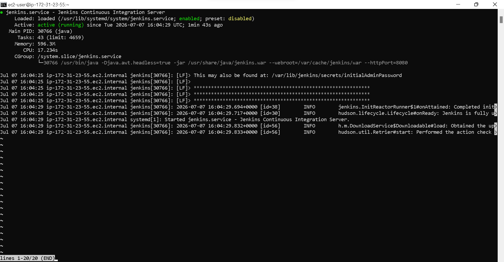
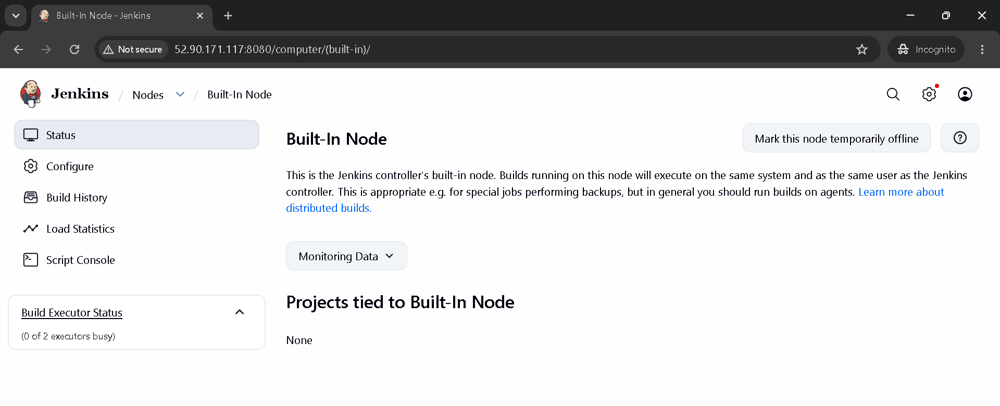
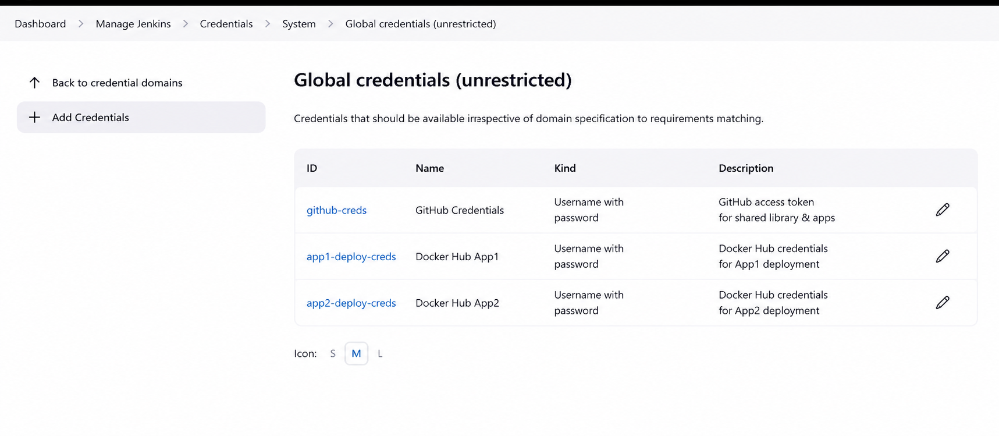
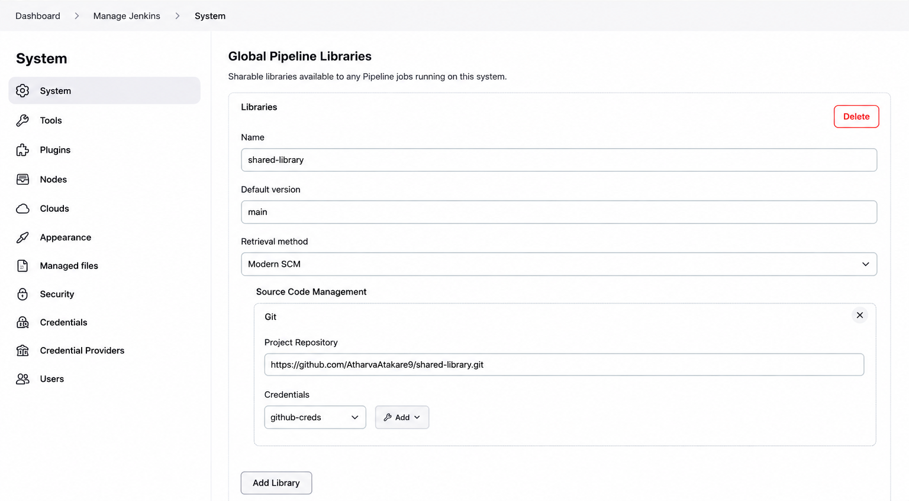
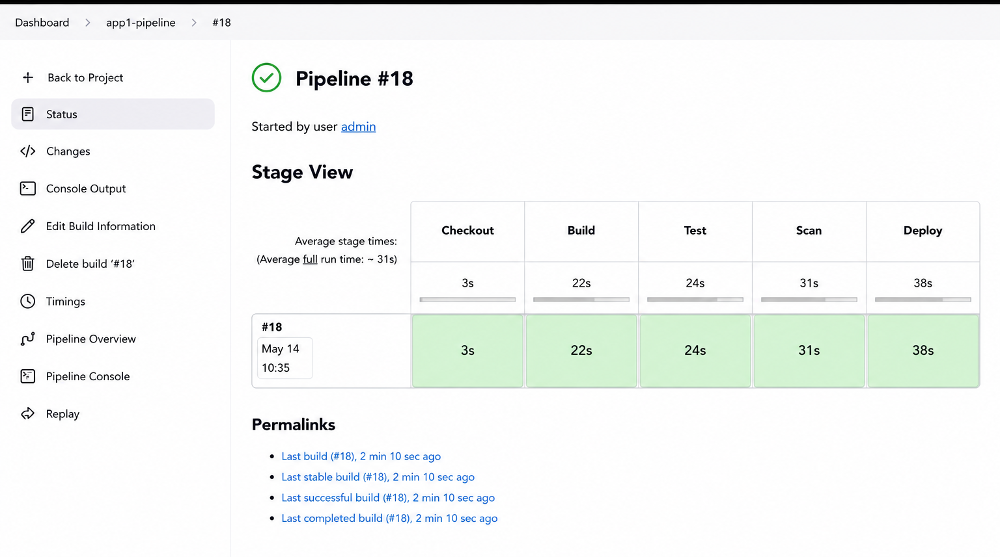
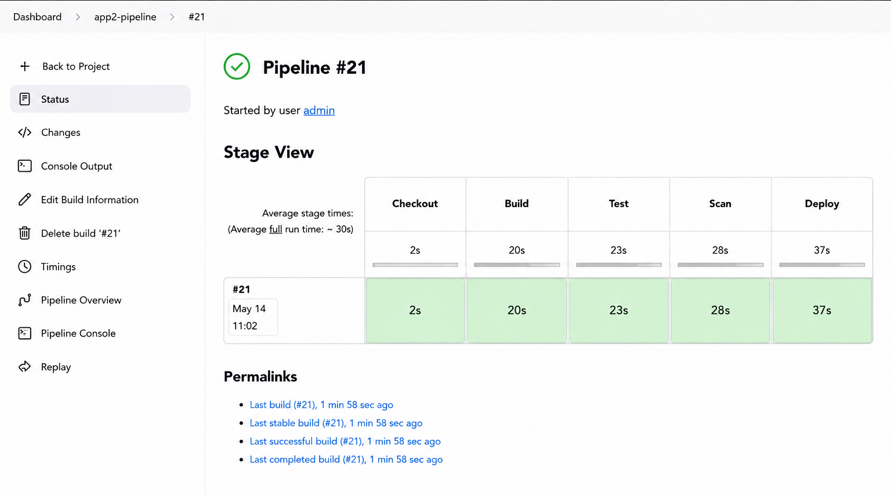
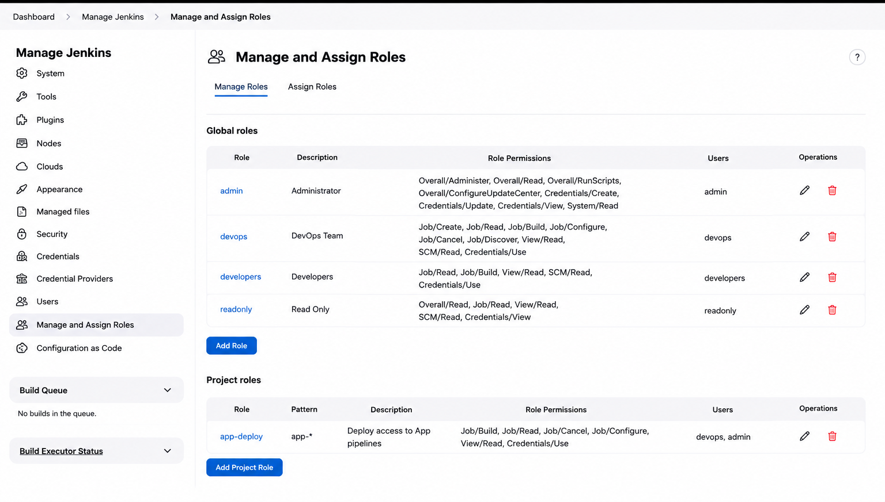

# Centralized CI/CD Platform using Shared Jenkins Infrastructure

## Folder Structure
```
project2/
├── README.md
├── jenkins-shared-library/
│   └── vars/
│       ├── standardPipeline.groovy   (entry point every app calls)
│       ├── buildStage.groovy
│       ├── testStage.groovy
│       ├── scanStage.groovy
│       └── deployStage.groovy
├── pipelines/
│   ├── app1-jenkinsfile   (sample app1 Jenkinsfile using shared lib)
│   └── app2-jenkinsfile   (sample app2 Jenkinsfile using shared lib)
└── screenshots/
    └── SCREENSHOTS.md     (template — replace with real screenshots)
```

## Scenario
Multiple teams each ran own Jenkins → duplicate infra, inconsistent pipelines, security misconfig. Goal: one shared Jenkins platform + shared pipeline library + standardized Build→Test→Scan→Deploy stages.

## Step 1 — Jenkins Infrastructure

1. Launch EC2 instance (Amazon Linux 2 / Ubuntu), open port 8080 + 22 in security group.
2. Install Jenkins:
   ```bash
   sudo yum update -y
   sudo wget -O /etc/yum.repos.d/jenkins.repo https://pkg.jenkins.io/redhat-stable/jenkins.repo
   sudo rpm --import https://pkg.jenkins.io/redhat-stable/jenkins.io-2023.key
   sudo yum install -y java-17-amazon-corretto jenkins docker
   sudo systemctl enable jenkins docker
   sudo systemctl start jenkins docker
   sudo usermod -aG docker jenkins
   ```
3. Unlock Jenkins at `http://<EC2_PUBLIC_IP>:8080` using `/var/lib/jenkins/secrets/initialAdminPassword`.
4. Configure agents: `Manage Jenkins → Nodes → New Node` (static agent) or configure EC2 Fleet plugin for dynamic agents that spin up/down with load.
5. Configure credentials: `Manage Jenkins → Credentials → System → Global credentials` — add Docker registry creds, GitHub token, per-app deploy creds (`app1-deploy-creds`, `app2-deploy-creds`).

Screenshot: capture Jenkins running + agents + credentials (SCREENSHOTS.md items 1–3).


## Step 2 — Shared Pipeline Library

1. Push `jenkins-shared-library/` folder to its own Git repo (e.g. `shared-library`).
2. Register it: `Manage Jenkins → System → Global Pipeline Libraries`
   - Name: `shared-library`
   - Default version: `main`
   - Retrieval method: Modern SCM → Git → repo URL
3. Library defines 4 standardized stages (`vars/*.groovy`) plus `standardPipeline.groovy` which wires them into one reusable pipeline: **Build → Test → Scan → Deploy**.

Screenshot: capture library registration (SCREENSHOTS.md item 4).

## Step 3 — Multi-Application Onboarding

Each app's `Jenkinsfile` just imports the shared library and calls `standardPipeline(...)` with its own params — see `pipelines/app1-jenkinsfile` and `pipelines/app2-jenkinsfile`. No app duplicates pipeline logic; only config values (app name, image name, test command, creds ID) differ.

Create 2 Jenkins multibranch/pipeline jobs pointing at each app's repo, using the respective Jenkinsfile. Run both — both should execute identical stage sequence with app-specific values.

Screenshot: capture both pipeline runs passing (SCREENSHOTS.md items 5–6).

## Step 4 — Access Control

1. Install "Role-based Authorization Strategy" plugin.
2. `Manage Jenkins → Manage and Assign Roles`:
   - **Developer role**: Build, Cancel, Read, Workspace — no Configure/Delete.
   - **Admin role**: full control (Configure, Delete, Manage Jenkins).
3. Assign users/groups to roles.

Screenshot: capture role matrix (SCREENSHOTS.md item 7).

## Governance Notes
- Single shared library = one place to fix/update pipeline logic for all apps.
- Standardized stages enforce security scan (Trivy) on every build before deploy — no app can skip it.
- RBAC ensures developers can trigger builds but cannot alter pipeline/credentials config.

## Technologies Used
Jenkins, GitHub, EC2, Docker, Groovy (shared library), Trivy (scan stage).

## Deliverables Checklist
- [x] Jenkins shared library repo content (`jenkins-shared-library/`)
- [x] Sample pipelines for 2 apps (`pipelines/`)
- [ ] Screenshots of multi-project pipelines (add to `screenshots/`)
- [x] README explaining platform design (this file)
-e 
---

# Screenshots

Replace placeholders below. Keep filenames, or update paths in this file.

## 1. Jenkins EC2 Instance Running

_(EC2 console showing Jenkins instance in running state, or `systemctl status jenkins` output)_

## 2. Jenkins Agents Configured


_(Manage Jenkins → Nodes, showing static/dynamic agents connected)_

## 3. Credentials Store


_(Manage Jenkins → Credentials, showing app1-deploy-creds / app2-deploy-creds entries — mask secrets before sharing)_

## 4. Shared Library Global Config

_(Manage Jenkins → System → Global Pipeline Libraries showing "shared-library" registered)_

## 5. App1 Pipeline Run


_(Blue Ocean or classic view showing Build→Test→Scan→Deploy stages passed for app1)_

## 6. App2 Pipeline Run

_(Same stage view for app2, proving same shared library reused)_

## 7. Role-Based Access Control


_(Manage Jenkins → Manage and Assign Roles, showing Developer vs Admin role matrix)_
